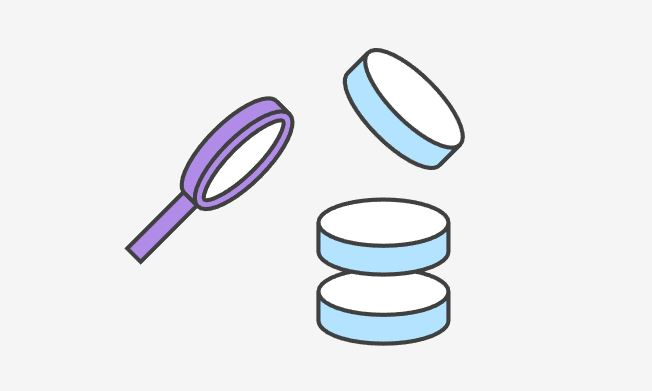

**git status**

*показывает текущий статус*

**git commit**

*используется для сохранения текущего состояния*

**git diff**

*показывает разницу между текущим и сохраненным файлом*

**git log**

*используется для просмотра журнала изменений*

**git checkout**

*используется для того, чтобы перейти к сохранению*

**git branch**

*показывает сколько существует веток*

**git checkout + название ветки**

*используется для перехода на указанную ветку*

**git merge + название ветки**

*используется для слияния текущей и указанной веток*

Синтаксис языка markdown можно посмотреть на github

сейчас будем пушить

сейчас произведем pull
